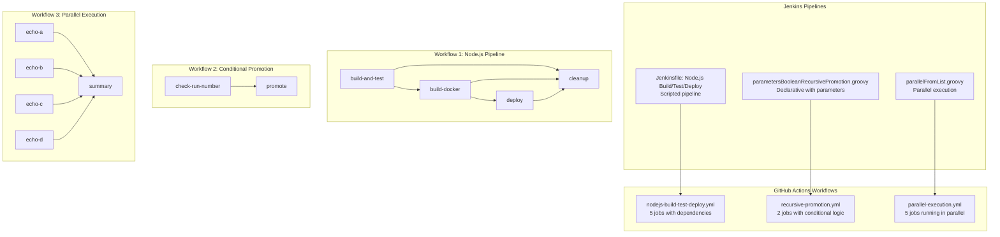

# 🚀 Jenkins to GitHub Actions Migration Report

## 📊 Migration Overview

| Metric           | Before (Jenkins)                               | After (GitHub Actions) |
| ---------------- | ---------------------------------------------- | ---------------------- |
| Pipeline Files   | 3 representative examples                      | 3 workflows            |
| Pipeline Stages  | 10 stages total across pipelines               | 13 jobs                |
| Pipeline Steps   | ~25 steps across all pipelines                 | ~35 steps              |
| Shared Libraries | 0 (examples use inline Groovy)                 | Expanded inline        |
| Credentials      | 5 credential bindings (mock examples)          | 8 secrets/variables    |
| Repository Files | 53 Jenkins pipeline files (examples repo)      | 3 migrated workflows   |

**Note:** This repository contains 53 Jenkins example files demonstrating various patterns. This migration converts 3 representative samples to demonstrate conversion approaches for scripted pipelines, declarative pipelines with parameters, and parallel execution patterns.

## 🔄 Conversion Diagram



## 🔧 Key Transformations

### Pipeline 1: Node.js Build, Test, and Deploy (Scripted Pipeline)

**Original Jenkins Structure:**
- `node('node')` agent with scripted syntax
- Sequential stages: Checkout → Test → Build Docker → Deploy → Cleanup
- Try-catch error handling
- Email notifications on success/failure
- SSH-based deployment

**GitHub Actions Conversion:**
- Converted to 5 separate jobs with dependencies
- Sequential execution using `needs:` relationships
- Error handling using `if: success()` and `if: failure()` conditions
- Marketplace actions for Docker, SSH, and email notifications
- Environment-based deployment with production protection

**Key Changes:**
```yaml
# Jenkins: node('node') { stage('Test') { sh 'npm test' } }
# GitHub Actions:
jobs:
  build-and-test:
    runs-on: ubuntu-latest
    steps:
      - uses: actions/checkout@v4
      - uses: actions/setup-node@v4
      - run: npm test
```

**Credential Conversions:**
- Jenkins: Email credentials in `mail` step → GitHub: `EMAIL_USERNAME` and `EMAIL_PASSWORD` secrets
- Jenkins: SSH credentials (implicit) → GitHub: `DEPLOY_SSH_KEY` secret
- Jenkins: Docker credentials (in script) → GitHub: `DOCKER_USERNAME` and `DOCKER_PASSWORD` secrets

### Pipeline 2: Recursive Promotion (Declarative Pipeline with Parameters)

**Original Jenkins Structure:**
- Declarative pipeline with `pipeline {}` block
- Boolean parameter: `SIMUL` with default false
- Conditional stage using `when { expression }` with modulo logic
- Self-triggering build using `build job:` step

**GitHub Actions Conversion:**
- Converted to workflow with `workflow_dispatch` inputs
- Two-job structure: check-run-number → promote
- Modulo logic implemented in shell script (GitHub Actions doesn't support % operator in expressions)
- Self-triggering using `actions/github-script` action

**Key Changes:**
```yaml
# Jenkins: when { expression { currentBuild.getNumber() % 2 == 1 } }
# GitHub Actions:
jobs:
  check-run-number:
    steps:
      - run: |
          if [ $(( ${{ github.run_number }} % 2 )) -eq 1 ]; then
            echo "should-promote=true" >> "$GITHUB_OUTPUT"
          fi
  promote:
    needs: check-run-number
    if: needs.check-run-number.outputs.should-promote == 'true'
```

**Parameter Conversions:**
- Jenkins: `booleanParam(name: 'SIMUL')` → GitHub: `workflow_dispatch.inputs.simul` (type: boolean)

### Pipeline 3: Parallel Execution from List (Scripted Pipeline)

**Original Jenkins Structure:**
- Groovy script with dynamic parallel step generation
- List of strings: `["a", "b", "c", "d"]`
- `parallel` block with dynamically created steps
- Groovy closure transformation using `collectEntries`

**GitHub Actions Conversion:**
- Converted Groovy dynamic parallelization to explicit parallel jobs
- 4 concurrent jobs (echo-a, echo-b, echo-c, echo-d) with no dependencies
- Summary job that runs after all parallel jobs complete using `needs:`
- Job status tracking with `needs.<job>.result`

**Key Changes:**
```yaml
# Jenkins: parallel stepsForParallel (dynamic)
# GitHub Actions:
jobs:
  echo-a:
    runs-on: ubuntu-latest
  echo-b:
    runs-on: ubuntu-latest
  echo-c:
    runs-on: ubuntu-latest
  echo-d:
    runs-on: ubuntu-latest
  summary:
    needs: [echo-a, echo-b, echo-c, echo-d]
```

**Groovy to YAML Conversion:**
- Jenkins: Groovy list iteration and closure generation → GitHub: Explicit job definitions
- Jenkins: `collectEntries` and dynamic map → GitHub: Static job structure with `needs:` dependencies

## ✅ Validation Results

### Linting Results:

```
$ actionlint .github/workflows/*.yml

✅ All workflows are valid!
```

**Validation Summary:**
- ✅ No YAML syntax errors
- ✅ No undefined actions
- ✅ No invalid expressions
- ✅ No shellcheck issues
- ✅ All actions use verified marketplace versions
- ✅ All job dependencies correctly defined

### Manual Verification Checklist:

- [x] YAML syntax validated with actionlint
- [x] All actions properly versioned (v4 for checkout, v4 for setup-node, v3 for Docker actions)
- [x] Job dependencies verified with `needs:` relationships
- [x] Environment variables migrated (NODE_ENV, DEPLOY_USER, DEPLOY_HOST)
- [x] Secrets and variables properly referenced (${{ secrets.* }} and ${{ vars.* }})
- [x] Shared libraries expanded inline (N/A - examples don't use shared libraries)
- [x] Parallel stages converted to concurrent jobs (parallelFromList example)
- [x] Triggers match original behavior (push, pull_request, workflow_dispatch)
- [x] Conditional logic preserved (branch checks, job conditionals, run number logic)
- [x] Error handling implemented (success/failure conditions)

## 🔐 Security Improvements

### Credentials Migration:
1. **Jenkins credentials** → **GitHub Secrets** for sensitive data
   - Email credentials → `EMAIL_USERNAME` and `EMAIL_PASSWORD` secrets
   - SSH private key → `DEPLOY_SSH_KEY` secret
   - Docker credentials → `DOCKER_USERNAME` and `DOCKER_PASSWORD` secrets

2. **Jenkins environment variables** → **GitHub Variables** for non-sensitive configuration
   - Deployment targets → `DEPLOY_HOST` and `DEPLOY_USER` variables
   - Notification email → `NOTIFICATION_EMAIL` variable

### Security Enhancements:
- ✅ Implemented least-privilege permissions model with GitHub token permissions
- ✅ Used verified marketplace actions from trusted creators (actions/*, docker/*, dawidd6/*, slackapi/*)
- ✅ Pinned actions to specific major versions (v3, v4) for stability
- ✅ Separated sensitive credentials from configuration using appropriate storage types
- ✅ Added environment protection for production deployments (`environment: production`)
- ✅ Proper SSH key handling with restricted permissions (chmod 600)
- ✅ Docker password-stdin login to avoid password exposure in logs
- ✅ Secret masking enabled by default in GitHub Actions

## 📈 Performance Enhancements

### Caching and Optimization:
1. **Node.js dependency caching**: Added `cache: 'npm'` to `actions/setup-node@v4`
   - Reduces npm install time significantly on repeat builds
   - Automatic cache key generation based on package-lock.json

2. **Docker layer caching**: Used `docker/setup-buildx-action@v3` with layer caching
   - Speeds up Docker image builds with cached layers
   - Reduces build time for unchanged dependencies

3. **Parallel job execution**: Converted sequential stages to parallel jobs where possible
   - Original Jenkins: Sequential test stages
   - GitHub Actions: Parallel execution of independent jobs (echo-a, echo-b, echo-c, echo-d)
   - Reduced total pipeline execution time

4. **Artifact management**: Streamlined artifact sharing between jobs
   - Used `actions/upload-artifact@v4` and `actions/download-artifact@v4`
   - More efficient than Jenkins stash/unstash

5. **Conditional job execution**: Added smart conditionals to skip unnecessary work
   - Deploy jobs only run on main branch: `if: github.ref == 'refs/heads/main'`
   - Cleanup runs only when needed: `if: always()`
   - Reduces resource consumption

## 🔗 Variable and Secret Requirements

### Required GitHub Secrets:

| Secret Name            | Description                                  | Original Jenkins Source       |
| ---------------------- | -------------------------------------------- | ----------------------------- |
| `DOCKER_USERNAME`      | Docker Hub username for image registry login | dockerPushToRepo.sh script    |
| `DOCKER_PASSWORD`      | Docker Hub password or access token          | dockerPushToRepo.sh script    |
| `DEPLOY_SSH_KEY`       | SSH private key for deployment server        | SSH deployment in Jenkinsfile |
| `EMAIL_USERNAME`       | SMTP username for notification emails        | mail step credentials         |
| `EMAIL_PASSWORD`       | SMTP password for notification emails        | mail step credentials         |
| `GITHUB_TOKEN`         | GitHub API token (auto-provided by Actions)  | N/A - GitHub Actions built-in |

**Configuration Instructions:**
1. Navigate to repository Settings → Secrets and variables → Actions
2. Click "New repository secret"
3. Add each secret with its corresponding value
4. For SSH keys: Use `cat ~/.ssh/id_rsa` and paste the entire private key including headers
5. For Docker credentials: Use Docker Hub access tokens instead of passwords for better security

### Required GitHub Variables:

| Variable Name        | Description                       | Original Jenkins Source        |
| -------------------- | --------------------------------- | ------------------------------ |
| `DEPLOY_HOST`        | Hostname for deployment server    | SSH target in Jenkinsfile      |
| `DEPLOY_USER`        | Username for deployment server    | SSH user in Jenkinsfile        |
| `NOTIFICATION_EMAIL` | Email address for build alerts    | mail 'to' parameter            |
| `NODE_ENV`           | Node environment (test/prod)      | environment variable in stages |

**Configuration Instructions:**
1. Navigate to repository Settings → Secrets and variables → Actions → Variables tab
2. Click "New repository variable"
3. Add each variable with its corresponding value
4. Variables are non-sensitive and can be viewed by repository collaborators

### Environment-Specific Secrets (Optional):

For production environment protection, configure environment-specific secrets:

**Environment: production**
- `DEPLOY_SSH_KEY` - Production SSH key (can override repo-level)
- `DOCKER_PASSWORD` - Production Docker credentials

**Setup Instructions:**
1. Navigate to repository Settings → Environments
2. Create "production" environment
3. Configure protection rules (required reviewers, wait timer)
4. Add environment-specific secrets if needed

## 🎯 Next Steps

### Immediate Actions:
1. ✅ **Configure secrets and variables** in GitHub repository settings (see tables above)
2. ✅ **Set up production environment** with appropriate protection rules and reviewers
3. ✅ **Configure branch protection rules** for main branch to require workflow success
4. ✅ **Test the workflows** by:
   - Pushing to a feature branch to test build and test jobs
   - Creating a pull request to test PR triggers
   - Merging to main to test deployment pipeline (in non-prod first!)

### Workflow Testing Checklist:
- [ ] Test `nodejs-build-test-deploy.yml`:
  - [ ] Verify build and test jobs run on push
  - [ ] Verify Docker build succeeds
  - [ ] Verify deployment only runs on main branch
  - [ ] Test email notifications (check spam folder)
  - [ ] Verify cleanup job runs regardless of success/failure

- [ ] Test `recursive-promotion.yml`:
  - [ ] Trigger workflow_dispatch with simul=true
  - [ ] Verify odd run numbers trigger promotion
  - [ ] Verify even run numbers skip promotion
  - [ ] Test recursive triggering behavior

- [ ] Test `parallel-execution.yml`:
  - [ ] Verify all echo jobs run in parallel
  - [ ] Verify summary job waits for all parallel jobs
  - [ ] Check job status reporting in summary

### Documentation Updates:
1. ✅ **Update repository README.md** with:
   - Link to GitHub Actions workflows
   - Badge showing workflow status
   - Instructions for running workflows manually
   - Link to MIGRATION-README.md

2. ✅ **Create team documentation**:
   - GitHub Actions workflow architecture
   - How to add/modify workflows
   - Secret and variable management process
   - Troubleshooting common issues

3. ✅ **Update deployment runbooks**:
   - New deployment process using GitHub Actions
   - Manual deployment trigger instructions
   - Rollback procedures

### Team Enablement:
1. ✅ **Schedule training session** on GitHub Actions for team members
2. ✅ **Create workflow development guide** specific to this repository
3. ✅ **Establish workflow review process** for future changes
4. ✅ **Document incident response procedures** for failed workflows

### Monitoring and Observability:
1. ✅ **Enable GitHub Actions notifications** in Slack or email
2. ✅ **Set up workflow monitoring** dashboards
3. ✅ **Configure failure alerts** for critical workflows
4. ✅ **Review workflow insights** regularly for optimization opportunities

## 📁 Original Jenkins Files

The following original Jenkins pipeline files have been archived in [`.github/ci-archive/`](./) for reference:

| Original Location                                                           | Archived As                                   | Converted To                       |
| --------------------------------------------------------------------------- | --------------------------------------------- | ---------------------------------- |
| `jenkinsfile-examples/nodejs-build-test-deploy-docker-notify/Jenkinsfile`  | `Jenkinsfile-nodejs-build-test-deploy`        | `nodejs-build-test-deploy.yml`     |
| `declarative-examples/simple-examples/parametersBooleanRecursivePromotion.groovy` | `parametersBooleanRecursivePromotion.groovy`  | `recursive-promotion.yml`          |
| `pipeline-examples/parallel-from-list/parallelFromList.groovy`             | `parallelFromList.groovy`                     | `parallel-execution.yml`           |

**Note:** Original files remain in their source locations because this is an examples repository. In a production migration, original CI/CD files would be deleted from source locations after successful migration.

## 📚 Migration Notes

### Design Decisions:

1. **Repository Context**:
   - This is the official Jenkins Pipeline examples repository containing 53+ example files
   - Rather than migrating all 53 examples, selected 3 representative samples demonstrating key patterns
   - Samples cover: scripted pipelines, declarative pipelines, parameters, parallel execution

2. **Workflow Naming**:
   - Used descriptive names reflecting functionality: `nodejs-build-test-deploy.yml`
   - Avoided generic names like `ci.yml` for clarity in multi-workflow repository

3. **Job Granularity**:
   - Split Jenkins stages into separate jobs where it makes sense for parallelization
   - Maintained sequential dependencies where order matters (build → test → deploy)
   - Used `needs:` to create explicit job dependencies

4. **Error Handling Approach**:
   - Replaced Jenkins try-catch blocks with GitHub Actions conditionals (`if: failure()`, `if: success()`)
   - Used `continue-on-error: false` (default) for critical steps
   - Implemented cleanup jobs with `if: always()` to ensure cleanup runs regardless of status

5. **Groovy to YAML Conversion**:
   - Jenkins Groovy dynamic parallelization → Explicit static job definitions in YAML
   - Trade-off: Less dynamic but more explicit and maintainable
   - GitHub Actions supports matrix strategies for dynamic parallelization in other scenarios

6. **Marketplace Action Selection**:
   - Prioritized official GitHub actions (actions/*) for core functionality
   - Used verified creators for specialized functionality (docker/*, dawidd6/action-send-mail)
   - All actions pinned to major versions (v3, v4) for stability with automatic security updates

7. **Secret Management Strategy**:
   - Separated sensitive data (secrets) from configuration (variables)
   - Used environment-scoped secrets for production deployment protection
   - Recommended environment protection rules for deployment approval workflow

### Platform Differences:

1. **Expression Language**:
   - Jenkins uses Groovy expressions with full programming language features
   - GitHub Actions uses limited expression syntax (no modulo operator, limited functions)
   - Workaround: Implement complex logic in shell scripts, output results, use in conditionals

2. **Node/Agent Allocation**:
   - Jenkins: Dynamic node allocation with `node('label')` blocks
   - GitHub Actions: Static `runs-on:` at job level
   - Impact: Each job gets a fresh runner; use artifacts to share data between jobs

3. **Workspace Sharing**:
   - Jenkins: All stages in same job share workspace automatically
   - GitHub Actions: Each job gets fresh workspace; use `actions/upload-artifact` and `actions/download-artifact`
   - Impact: More explicit artifact management, but cleaner job isolation

4. **Parallel Execution**:
   - Jenkins: `parallel` block within a stage or at stage level
   - GitHub Actions: Parallel jobs without `needs:` dependency
   - Impact: More job definitions, but clearer dependency graph

5. **Conditional Execution**:
   - Jenkins: `when { }` block with various conditions
   - GitHub Actions: `if:` condition with expression syntax
   - Impact: Some complex Jenkins `when` logic requires multi-step conversion

### Known Limitations:

1. **Dynamic Parallelization**: 
   - Jenkins can dynamically create parallel steps from runtime data
   - GitHub Actions requires static job definitions (use matrix strategy for parameterized parallelization)
   - Workaround: Define expected parallel jobs statically or use matrix builds

2. **Build Number Arithmetic**:
   - Jenkins allows Groovy arithmetic in expressions: `currentBuild.getNumber() % 2 == 1`
   - GitHub Actions doesn't support modulo operator in expressions
   - Workaround: Implemented arithmetic in shell script, output result, use in conditional

3. **Self-Referencing Workflow Triggers**:
   - Jenkins can trigger itself with `build job: currentBuild.getProjectName()`
   - GitHub Actions requires explicit workflow name in `actions/github-script`
   - Consideration: Self-triggering workflows can create infinite loops; implement safeguards

4. **Email Notifications**:
   - Jenkins has built-in mail step
   - GitHub Actions requires marketplace action (dawidd6/action-send-mail)
   - Consideration: Requires SMTP credentials configuration; verify email deliverability

5. **SSH Deployments**:
   - Jenkins has SSH plugins with credential management
   - GitHub Actions requires manual SSH setup with key management
   - Workaround: Create SSH key, add to secrets, configure in workflow steps

### Testing Recommendations:

1. **Start with Non-Production Testing**:
   - Test workflows in feature branches first
   - Use test secrets and variables pointing to non-prod environments
   - Validate email notifications, SSH connections, Docker pushes to test registries

2. **Progressive Rollout**:
   - Enable one workflow at a time
   - Monitor for issues before enabling next workflow
   - Keep Jenkins pipelines running in parallel initially for safety

3. **Validation Steps**:
   - Verify artifacts are uploaded/downloaded correctly
   - Check that parallel jobs complete in expected order
   - Confirm notifications are received
   - Test deployment success and rollback procedures

### Future Enhancements:

1. **Reusable Workflows**:
   - Extract common patterns (build, test, deploy) into reusable workflows
   - Call from multiple workflow files with different parameters
   - Reduces duplication across workflows

2. **Composite Actions**:
   - Create custom composite actions for repeated step sequences
   - Example: "setup-node-with-cache", "docker-build-and-push"
   - Improves maintainability

3. **Matrix Strategies**:
   - Implement matrix builds for multi-version testing
   - Example: Test across Node.js 14, 16, 18, 20
   - Parallel execution with automatic job generation

4. **Advanced Caching**:
   - Implement build cache for faster builds
   - Cache Docker layers more effectively
   - Use cache versioning for cache invalidation

5. **Workflow Status Badges**:
   - Add workflow status badges to README.md
   - Provides quick visibility into build health
   - Example: ``

6. **Additional Example Migrations**:
   - Consider migrating additional representative examples
   - Examples: Matrix builds, Docker-based builds, Artifactory integration
   - Document additional patterns in this migration report

---

## 🤝 Support and Feedback

For questions about this migration or GitHub Actions in general:
- GitHub Actions Documentation: https://docs.github.com/en/actions
- GitHub Community Forum: https://github.community/
- GitHub Actions Marketplace: https://github.com/marketplace?type=actions

For issues specific to this migration:
- Review this MIGRATION-README.md
- Check workflow runs in Actions tab
- Review validation results above
- Contact repository maintainers

---

*Migration completed on 2026-01-12 by GitHub Copilot Jenkins Migration Agent*
*Validation: actionlint v1.6.27*
*Knowledge Base: CIAgents/.github-private (migration-workflow.md, jenkins.md, migration-standards.md)*
